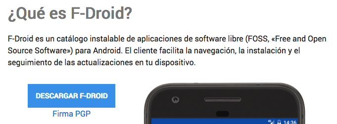

# 📱 F-Droid

## ¿Qué es F-Droid?

Algo que nos resulta extraño de inicio es que, normalmente, lo que hacemos es instalar apps en nuestro móvil/celular. En este caso vamos a descargar una app que nos permitirá descargar otras, y no se encuentra en PlayStore.

## Cómo instalarlo

* Ve a la página [https://f-droid.org/](https://f-droid.org/)
* Pulsa el botón **DESCARGAR F-DROID** como en la imagen más abajo


#### El enlace directo para descargar es [https://f-droid.org/FDroid.apk](https://f-droid.org/FDroid.apk)


* Una vez instalado actualiza los repositorios y ya podrás empezar a instalar apps desde aquí.


El móvil/celular te dirá que **no puede** instalar servicios de terceros.

### **ACEPTA para poder continuar.**


Conoce las aplicaciones que podrás instalar desde aquí en la siguiente página.

