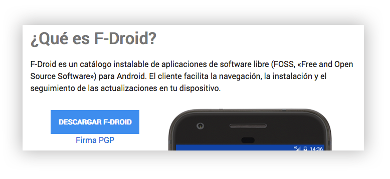

# 📱 F-Droid

## 쯈u칠 es F-Droid?


_F-Droid es un catálogo instalable de aplicaciones de software libre \(FOSS, «Free and Open Source Software»\) para Android. El cliente facilita la navegación, la instalación y el seguimiento de las actualizaciones en tu dispositivo._


Algo que nos resulta extraño de inicio es que, normalmente, lo que hacemos es instalar apps en nuestro móvil/celular. En este caso vamos a descargar una app que nos permitirá descargar otras, y no se encuentra en PlayStore.

## Cómo instalarlo

1. Ve a la página [https://f-droid.org/](https://f-droid.org/)
2. Pulsa el botón **`DESCARGAR F-DROID`** como en la imagen más abajo.
3. O si prefieres el enlace directo para descargar es ****[**https://f-droid.org/FDroid.apk**](https://f-droid.org/FDroid.apk)
4. Una vez instalado actualiza los repositorios y ya podrás empezar a instalar apps desde aquí.


El móvil/celular te dirá que **no puede** instalar servicios de terceros.

### **ACEPTA para poder continuar.**



No te olvides que este tipo de proyectos se mantienen gracias a los **aportes desinteresados.** Puedes contribuir de muchas formas además de [DONANDO](https://f-droid.org/es/contribute/).


